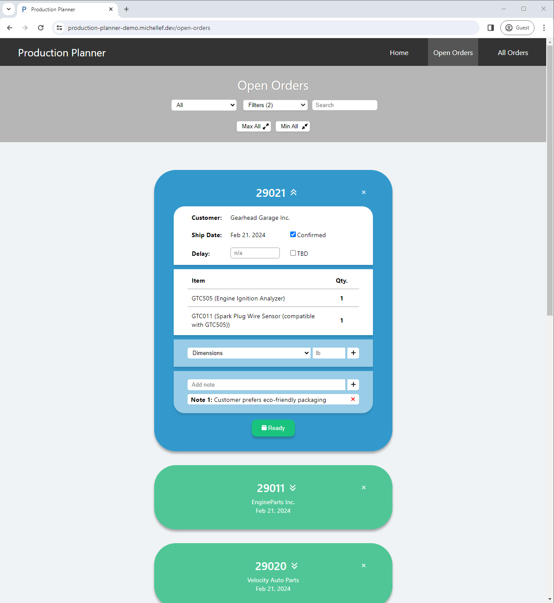
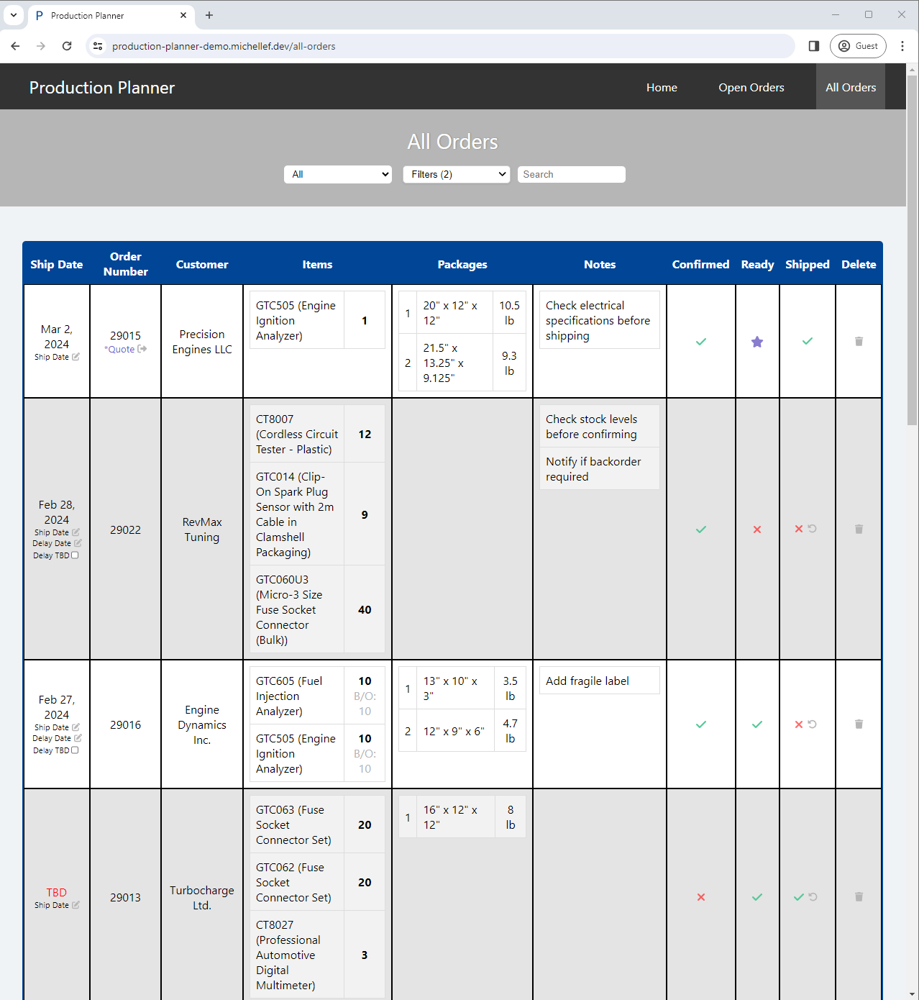

# Production Planner

A web application designed to streamline the sales-shipping process in a manufacturing setting.

## Table of Contents
- [Technologies Used](#technologies-used)
- [Features](#features)
- [Architectural Decisions](#architectural-decisions)
- [What I Learned](#what-i-learned)
- [What I Would Do Differently](#what-i-would-do-differently)
- [First-Time Setup](#first-time-setup)
- [First-Time Setup - Development](#setup-development)
- [First-Time Setup - Production](#setup-production)
- [How To Start the App](#how-to-start-app)
- [How To Use the App](#how-to-use-app)
- [How To Backup the Database](#backup-database)
- [How To Restore the Database](#restore-database)
- [How To Clear the Database](#clear-database)
- [How To Fetch Updates From GitHub](#fetch-updates)
- [How to Update Docker](#how-to-update-docker)
- [Troubleshooting](#troubleshooting)
- [To Do](#to-do)
- [Credits](#credits)

## Technologies Used
- Python
- Django
- React
- MySQL (Production)
- SQLite (Development)
- Docker

## Features
- In-process scheduling (Python) for continuous data retrieval from QuickBooks (via QODBC) to Production-Planner database
- Instant error notification emails for critical application/backup errors
- Stored package data for instant new order dimension/weight estimates
- Server-Sent Events (SSE) for continuous updates between database and frontend
- Database indexing and backend Pagination for quick order filtering
- Hashing of order items for quick package dimensions/weight quotes (when available)

  
  

## Architectural Decisions
- **Django and Django Rest Framework for the Backend:** Given Django's robust security features and the Django Rest Framework's powerful serialization capabilities, this combination was chosen to expedite API development and ensure data integrity.
- **React for the Frontend:** React's component-based architecture enhances the user interface's responsiveness and facilitates the development of a dynamic, single-page application.
- **Docker for Containerization:** To simplify deployment and ensure consistency across development, testing, and production environments, Docker was chosen. It allows for easy setup and scalability of the application.
- **MySQL and SQLite:** MySQL is used in production for its scalability and reliability. For development, SQLite is used for its simplicity and ease of configuration, speeding up the initial setup and testing phases.

## What I Learned
- **The Importance of Database Design:** Proper normalization and indexing strategies in MySQL significantly improved query performance, especially when handling complex joins and aggregations necessary for production planning.
- **Efficient Error Handling:** Implementing centralized error handling and logging mechanisms has streamlined troubleshooting and monitoring, making the application more robust against failures.
- **The Power of Continuous Integration/Continuous Deployment (CI/CD):** Automating the build, test, and deployment processes with Docker and GitHub Actions has reduced manual errors and sped up the release cycle.

## What I Would Do Differently
- **Start with a Comprehensive Requirement Analysis:** Initially, some user requirements were not fully understood, leading to feature adjustments late in the development process. A more thorough upfront requirement gathering could have mitigated this.
- **Invest in Automated Testing from the Start:** While tests were added progressively, having a comprehensive test suite from the beginning would have reduced bugs in production and facilitated refactoring and feature additions.

## First-Time Setup
- Install Git: 
  - Download the Git installer for Windows: https://git-scm.com/download/win
- Open a PowerShell Terminal (if using VSCode make sure to close + open VSCode after installing Git to apply path changes)
- Clone the project repository from GitHub:
  - Open a Terminal and navigate to the folder you want to save the Production Planner app to
  - In the terminal, run: git clone https://github.com/michellevit/Production-Planner.git
 - Set the environment variables:
  - ROOT DIRECTORY .env FILE: 
    - Create a new file, in the project's root directory, named '.env'
    - Copy-paste the data from the existing 'env.txt' file into the new '.env' file
    - Replace the placeholder data with real values
      * Note: the env.txt file includes instructions to get new secret keys, etc
    - Change the file name from 'env.txt' to '.env'
  - REACTAPP .env FILE: 
    - Create a new file, in the project's reactapp folder, named '.env'
    - Copy-paste the data from the existing 'env.txt' file into the new '.env' file
    - Replace the x's in the URLs with 'localhost' or your network's IP address
      * Note: this can be found by opening a command prompt on your computer and run: 'ipconfig' and the IPv4 Address should be the address you need
    - Change the file name from 'env.txt' to '.env'
- Install node.js: https://nodejs.org/en
- Create a virtual environment in the main folder:
  * Note: you can instead open 'scripts/installing-to-vritual-env.bat', uncomment the relative lines + run it
  - Run: cd C:\path\to\project\Production-Planner 
  - Run: python -m venv venv
  - Run: cd C:\path\to\project\Production-Planner
  - Run: .\venv\Scripts\activate
  - Run: pip install -r requirements.txt
 Follow instructions for 'First-Time Setup - Development' OR 'First-Time Setup - Production'

## First-Time Setup - Devlopment
- Go to the file django/Production_Planner/settings.py:
  - Change 'DEVELOPMENT_MODE' to True
    - This will switch the database to SQLite (unlike MySQL which requires Docker container to run)
  - Change 'DEBUG' to True
    - Now print statements (in the backend) will output in the terminal where the server is running
- Activate the virtual environment: 
  - Open terminal and navigate/cd to the project's root folder
  - Use the command: # C:/path/to/project/Production-Planner/venv/Scripts/Activate.ps1
- Initialize the Database: 
  - In the terminal, navigate to the django folder and run: python manage.py makemigrations
  - Then run: python manage.py migrate
- Populate the 'Dimension' DB Table:
  - In the terminal, navigate to the folder: Production-Planner/django
  - Run: python manage.py import_dimensions_to_db
- Populate the 'Product' DB Table:
  - In the terminal, navigate to the folder: Production-Planner/django
  - Run: python manage.py import_products_to_db
- Create a superuser to access Django admin site:
  - cd into the django folder
  - python manage.py createsuperuser
  - Use credentials from the .env file
  - To access Django's admin interface - go to broswer url: http://localhost:8000/admin

## First-Time Setup - Production
- Go to the file django/Production_Planner/settings.py
  - Change 'DEVELOPMENT_MODE' to False
    - This will switch the database to MySQL (unlike SQLite which does not require Docker, but is less robust for production)
  - Change 'DEBUG' to False
    - Now print statements (in the backend) will output in the Docker 'backend' image logs
- Download Docker
- Enable Virtual Machine Platform on Windows
  - Open PowerShell as an administrator
  - Run: dism.exe /online /enable-feature /featurename:Microsoft-Windows-Subsystem-Linux /all /norestart
  - Then Run: dism.exe /online /enable-feature /featurename:VirtualMachinePlatform /all /norestart
- Install WSL 2 (if not already installed)
  - In the terminal - run: wsl --install
- Enable virtualization in computer's BIOS
  - Access the Bios: restart the computer and enter BIOS (Look for a message on your screen during boot that tells you which key to press to enter the BIOS/UEFI setup - usually F2, F12, Delete, or Esc)
- Navigate to Advanced settings
  - Locate Virtualization Technology and enable it
  - Save and Exit
  - Restart computer
- Start the Docker container: 
  - Open the terminal and navigate/cd into the project
  - Start Docker (or make sure it is already running)
  - Run 'docker-compose build'
  - Then run 'docker-compose up'
  * Note: it may take ~5-8 minutes for the react server to start
- Install MySQL client tools:
  - In the terminal, run the following command to install the MySQL client (default-mysql-client): 
    - docker exec -it production-planner-backend-1 bash
    - apt-get update
    - apt-get install default-mysql-client
- Initialize the Database: 
  - Run migrations for the database:
    - In the terminal, navigate to the project root directory 
    - Run: docker-compose exec backend python manage.py migrate
- Populate the 'Dimension' DB Table:
  - In the terminal, navigate to the project root directory
  - Run: docker-compose exec backend python manage.py import_dimensions_to_db
- Populate the 'Product' DB Table:
  - In the terminal, navigate to the project root directory
  - Run: docker-compose exec backend python manage.py import_products_to_db
- Create a superuser to access Django admin site:
  - cd into the django folder
  - python manage.py createsuperuser
  - Use credentials from the .env file
  - To access Django's admin interface - go to broswer url: http://localhost:8000/admin
- Setup QODBC DSN Connection 
  - Install QODBC (link at bottom of webpage): https://qodbc.com/what-is-qodbc/
  - Search for "QODBC" in Windows search bar and right-click 'Open file location'
  - Open file 'Configure 64-Bit QODBC Driver'
    - Select 'System DSN' tab
    - Click Add
    - Select QODBC Driver for QuickBooks
    - Click Finish
    - Locate the company file (open QuickBooks, login, click F2, file location will appear here)
    - Data Source Name: 'Production-Planner-DSN'
      - Note: it is important to use this exact data source name
    - Select 'Multi-user Mode'
    - Test Connection to QuickBooks (make sure it's successful)
    - Click OK
    - Click OK
- Create a Task on Windows Task Scheduler to run 'backup-database.bat' every morning at 6:15 AM:
  - Click on the Start menu and type "Task Scheduler" in the search bar
  - Open the Task Scheduler application
  - In the Task Scheduler, go to the "Action" menu and select "Create Basic Task..."
    - Name the task "Production-Planner-Backup-Database-Batch-Task"
    - Choose "Daily"
    - Set start date + time (6:15AM)
    - Set frequency: repeat task every day
    - Set the script: click browse and select the batch file (in the scripts folder) + click open
    - Review settings + click "Finish"
    - Customize for Weekdays only: 
      - In the Task Scheduler Library, find the task you just created and right-click on it.
      - Select "Properties".
      - Go to the "Triggers" tab and edit the trigger you created.
      - Under "Advanced settings", click on "Weekly".
      - Choose Monday, Tuesday, Wednesday, Thursday, and Friday.
      - Click "OK" to save the changes.
- NOTE: the start-scheduled-task.bat does not run via Windows Task Scheduler because to run QODBC via the Task Scheduler requires the (paid) QODBC Remote version

## How To Start the App
  * Note: it may take several minutes for the frontend to load (approx. 6 minutes)
- In PRODUCTION:
  - Option 1 (via batch file - scheduled updates every 2 mins, Mon-Fri 6AM-6PM):
    - Open QuickBooks and log in
    - Navigate to the project's 'scripts' folder + run start-app.bat
    - Stopping instructions: Navigate to the project's 'scripts' folder + run stop-app.bat
  - Option 2 (via batch file - manual one-time sync from QB to database):
    - Open QuickBooks and logged in
    - Open a command prompt + navigate to the project's 'scripts' folder
    - Run: manually_fetch_data.bat
    - Stopping instructions: stop the docker by running scripts/docker_scripts/docker-stop.bat
  - Option 3 (via Docker - with no sync to QuickBooks): 
    - Open Docker and click to run the Production-Planner container
    - Note: if the container is not built in Docker then you cannot use this method
  - Option 4 (via Terminal):
    - In the terminal, navigate to the project's root directory
    - Run: docker-compose up
    - Stopping instructions: cd to the project directory and run docker-compose down
 - In DEVELOPMENT:
  - Start the server:
    - Navigate to the django folder (in the terminal) 
    - Run: python manage.py runserver
  - Start the reactapp:
    - Navigate to the reactapp folder (in the terminal)
    - Run: npm start

## How To Use the App
- Open the browser:
  - Frontend: open the browser to http://000:000:0:000/3000/ (use IP address set in .env file or 'localhost' instead of '0:0:0:0')
  - Backend: open the browser to http://000:000:0:000/8000/ (use IP address set in .env file or 'localhost' instead of '0:0:0:0')
  - Backend Admin Page: open the browser to http://000:000:0:000/admin/ (use IP address set in .env file or 'localhost' instead of '0:0:0:0')
  - Production Team:
    - Navigate to the 'Open Orders' page to add shipping details for the unshipped orders
    - Navigate to the Home -> 'Last Update' tab to see if the connection is active and data is current (if the dot is green the QuickBooks connection is active and data is up-to-date)
    - Navigate to the Home -> 'Add Dimensions' tab to add more dimensions to the open-orders package options
  - Sales/Shipping Team: 
    - Navigate to the Home -> 'Add Order' tab to manually add an order/quote, or get a dimensions/weight quote for an order
    - Navigate to the 'All Orders' page to review shipping details
- Notes:
  - This app (when running) is scheduled to continuously sync to QuickBooks betwen 6AM-6PM, Monday-Friday
  - To fetch data after this period: 
    - For one time data retrieval: run scripts/sync-data.bat
    - To modify working hours period: go to scripts/scheduled_task_executor.py file + adjust the 'Schedule Global Variables'

## How To Backup the Database
 * Note: The backup-database.bat script will delete old backups, keeping only the 10 most recent backups
 * Note: The backup-database.bat file is scheduled to run at 6AM each week day
 * Note: the Docker container must be running to backup and/or restore
- To backup the database:
  - In the project's root directory, double click the 'backup-database.bat' file
  - The backup will be saved in the 'db-backups' folder
- To disable the automated backup
  - Open Windows' Task Scheduler program (on the computer running the app)
  - Highlight the Task named "Production-Planner-Backup-Database-Batch-Task"
  - Under the 'Action' tab on the right, select Disable
  - To change the action trigger time:
    - Under actions, select 'Properties' (or right-click the task and select proeprties)
    - Go to the Triggers tab, select the trigger and select the 'Edit..' button 

## How To Restore the Database
- To restore to the most recent backup:
  - Go to the scripts/error_scripts folder
  - Double-click the 'restore-database-from-latest-backup.bat' 
  - A command prompt will appear with the name/date of the latest backup and ask if you are sure you want to restore
    - Type "Y" and press enter (to confirm and restore the database)
    - Close the prompt

## How To Clear the Database
- Option 1: 
  * To delete entries via Django Admin Interface (works in both Production/MySQL or Development/SQLite)
  - Go to http://localhost:8000/admin
  - Login with credentials in .env file
  - Manually delete entries
- Option 2:
  * To delete the entire database through the terminal (works only in Development/SQLite)
  - Open the terminal and navigate to the 'django' folder of the project
  - Run 'python manage.py flush' and confirm yes
- Option 3: 
  - *To delete when using Docker/MySQL (works only in Production/MySQL)
  - Navigate to the project's root folder
  - Run: docker exec -it production-planner-db-1 bash
  - mysql -u *username (in .env file)* -p
  - Enter password (in .env file)
  - Select the database: USE Production_Planner_DB
    - To list all the tables in the db: SHOW TABLES;
  - Delete data from each table (and reset index): TRUNCATE TABLE *table name (i.e. api_order)*;
  - Exit MySQL: EXIT;
  - Exit the container shell: exit

## How To Fetch Updates From GitHub
- Open a Terminal and navigate to the Production-Planner directory
- Select the main branch: git checkout main
- Run: git pull origin main
- Rebuild Docker container:
  - One-Click:
    - Go to scripts/docker_scripts + run docker-compose-reset-container.bat
  - Manually: 
    - Run: docker-compose down
    - Run: docker-compose build --no-cache
    - Run: docker-compose up
    - Run: docker image prune -f

## How To Update Docker
- If changes were made to the entire app in VSCode:
  -Automated way:
    - Go to scripts/docker_scripts
    - Run docker-migrate.bat
  - Manual way:
    - docker-compose down
    - docker-compose build
      - Add '--no-cache' to build from scratch, ignoring previuous builds
    - docker-compose up
- If changes were just made to one image: 
  - docker build -t your_image_name .
- If changes were made to the models.py file:
  - Make sure the Docker container is running
  - One-click:
    - Go to scripts/docker_scripts + run docker-migrate.bat (runs makemigrations + migrate)
  - Manually:
    - CD into the project's root directory
    - Run: docker exec -it production-planner-backend-1 python manage.py makemigrations
    - Run: docker exec -it production-planner-backend-1 python manage.py migrate
- If changes were made to a static file (e.g. django/api/static/welcome.css): 
  - Delete all the welcome.css file versions in django/static
  - CD into the project's root directory
  - Run: docker exec -it production-planner-backend-1 python manage.py collectstatic --noinput

## Troubleshooting
- CORs / https issues? 
  - Clear browser history + cache
- If a critical error email was received:
  - Open the scripts/error_scripts/error-log.txt  
  - Read the error-log.txt contents
  - Delete the error-log once the problem is solved (manually or run script/error_scripts/clear-error-log.bat)
- If batch file debugging: 
  - Add " >> %errorLog% 2>&1" after python commands to get more error details
    - Example: python check_quickbooks.py >> %errorLog% 2>&1
    * Note: can cause write-failures to error-log.txt, so only use for debugging specific scripts one-at-a-time
  - Make sure you are in the correct directory for -everything-
- If docker-compose build not working: 
  - Make sure there is no node_modules folder accidentally in the root directory 
  - Make sure there is a .dockerignore file in the reactapp to ignore the node_momdules folder
- If welcome.css (or other static) file changes don't implement:
  - Delete the multiple welcome.css files (+ cached variations - e.g. welcome.98433745.css) in django/static:
  - cd into the django folder and run: python manage.py collectstatic
- If the start-scheduled-task.bat stops working: 
  - Make sure there isn't a stale script.lock or stop.flag file in the scripts folder
  - This can occur if: 
    - The computer unexpectedly shuts down (power outtage)
    - The command prompt, running start-scheduled-task.bat is unexepectedly closed
    - An unexpected error occurs in the code
- If worried that multiple instances of scheduled_task_executor.py are running: 
  - Automated: 
    - Go to scripts/error-scripts
    - Run: stop-all-instances-of-tasks.bat
  - Manual check:
    - Open the Task Manager
    - Go to the "Details" tab
    - Look for python.exe or python3.10.exe 
    - Check the command line column (you might need to add this column if it's not visible)
    - If the path matches the below details, then it is running: 
      - Name: python.exe or cmd.exe
      - CPU: 00
      - Status: Running
      - Command Line: python -u scheduled_task_executor.py
- If there is an issue getting data after wiping the database:
    -check django/api/data/current_open_orders.json (you may need to clear this file)  
- If you wipe the Order table: 
  - Make sure to also delete the django/api/data/current_open_orders.json
- General:
  - Check the Docker logs
  - Try to rebuild/up the container: scripts/docker-scripts/docker-compose-reset-container.bat

## To Do
- Heroku: can't refresh on frontend pages (other than index.html)
- Redesign navigation (left sidebar)
- Redesign 'Open Orders' + 'All Orders' (inspiration from SR)
- Add 'invoiced' field/icon
- Add more edit options on All Orders page (e.g. add note, add dimensions)
- Add option to specify who wrote the note + if it was acknowledged
- Handle error: someone inputs same item in 2 diff line items (give item dicts an id field)
- Deleted order functionality (Recycle Bin tab w/ recently deleted orders + auto delete after 1 month)
- Don't hardcode PST -> change UTC and then page to specify timezone in frontend (e.g. Django settings, p python scheduler, models, views, error scripts, etc)
- Handle backorders solely with previously_invoiced_items field (current way is specific to GTC custom QB template)
- Allow users to choose which backup to restore to
- Automatic backup should occur with Python, not Windows Task Scheduler
- Make program run on it's own, instead of browser - e.g. Electron or NW.js
  - Fix how filters are saved instead of saving in chrome memory
- Create an installer package (Inno Setup or Advanced Installer)
- New 'Settings' page: 
  - Set environment variables
  - Set administrator email (for error notifications)
  - Turn on/off sync
  - Set sync hours
  - Set automatic database backup time
  - Option to create a backup
  - Option to restore from backup (+ select which backup to restore to)
  - Display error/process log
  - Page to map custom fields (backorders, etc)
  - Shipping account details
- Figure out how to push updates to separate users 
- Secure data (+ keep data local)
- Integrate shipping UPS/FedEx, and options for USMCA forms, B13, etc
- Integrate products from QB directly to software (so you can map items per box)
- Add tracking number to orders + automaticcally add dimensions/weight/tracking no./arrival, etc to orders (QODBC paid version for write capabilities)
- Make it so tracking data can easily get added to invoice emails
- Licesnse key for software licensing
- Trial period
- Website with user authentification (login) for subscription management
- Payment processing integration
- Customer support
- Legal policy
- Divide OrderCard into more components (for readability)
- Rewrite all error/confirmation handling into consistent system wide singular Modal
- Review Cors origins in settings.py
- Separate frontend/backend in Heroku app demo (easier to update)

## Credits
Michelle Flandin